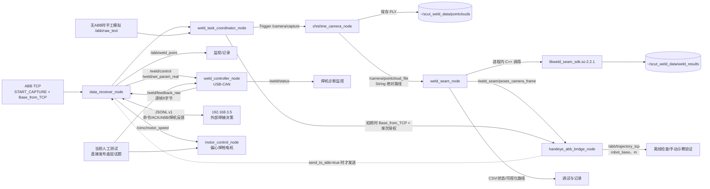

# SCUT/CIMC x86 ROS 2 精简工作区

本工作区面向 Ubuntu 22.04 x86_64 + ROS 2 Humble，用于 Chishine 3D 相机采集、波纹板焊缝识别、手眼变换、ABB 通信以及后续焊机/旋弧电机联动。

当前已经打通“相机软件触发 -> PLY -> 焊缝 SDK -> 相机坐标系焊接位姿 -> 手眼变换 -> `robot_base` 轨迹”的 ROS 2 链路。2026-09-03 现场测试已证明变换后 XYZ 与实际焊缝点基本重合。2026-09-05 已将算法 Tool X 从随局部角平分线变化改为可配置的工件 `+X/-X` 参考，并完成多组现场 PLY 离线回归；仍需在重新定义 ABB tooldata 和重新手眼标定后进行真实机器人姿态/可达性验证。

2026-09-10 开始把焊接工艺决策移交给 `192.168.3.5`：x86 不再根据 ABB 点号自行选择工艺，只负责校验并执行送气、起焊、实时电流/旋转速度和停焊指令。双方固定使用逐行 JSON v1 协议；`data_receiver_node` 把第三方请求直接映射到现有焊机/电机话题，并把 ABB 数据和每个焊机 TPDO1 真实反馈按带边界的 JSON 帧发回 `192.168.3.5:50000`。完整协议见 [第三方焊接通信协议.md](./第三方焊接通信协议.md)。

本版本提供阶段性的 `camera_weld_handeye_test.launch.py`，只启动相机、焊缝感知、手眼桥和任务协调节点。它不是生产 launch，不启动 ABB TCP、焊机、焊接逻辑或电机节点，且强制 `send_to_abb=false`。

## 1. 最终目录和保留内容

```text
x86_ros2_ws/
├── README.md
├── order.txt
├── ROS2全部节点与接口说明.md
├── 实际启动与分节点测试手册.md
├── 第三方焊接通信协议.md       # 与192.168.3.5约定的JSONL v1
├── x86_chishine_camera_test/   # 相机SDK与独立抓图参考，COLCON_IGNORE
├── x86_chishine_live_viewer/   # 实时点云选位工具，COLCON_IGNORE
├── scut_weld_sdk_install/      # 可随Git保存的焊缝SDK安装副本
└── src/
    ├── cimc/                    # Python：ABB 数据 + 旋转焊枪电机
    ├── weld_controller/         # C++：USB-CAN 焊机 + 历史工艺逻辑
    ├── chishine_camera_ros2/    # C++：相机发现、软件触发、PLY 发布
    └── weld_seam_perception/    # C++：进程内调用 weld_seam_sdk
```

仓库根目录的三个参考/SDK目录通过 `COLCON_IGNORE` 与 ROS package 隔离。当前机器仍优先使用 `~/x86_chishine_camera_test/vendor_sdk` 和 `~/scut_weld_sdk_install`；换机时需要按本文设置 SDK 路径。旧 `weld_logic_node.cpp` 只保留为历史源码，不再编译或安装；第三方命令由 `data_receiver_node` 直接映射到底层话题。

每个包目录均有自己的中文 `README.md`，说明内部源码、参数和接口。

## 2. 节点关系总图



相机节点与算法节点通过“文件绝对路径”解耦。相机服务返回成功且 PLY 完整写盘后才发布路径，算法节点收到路径后同步提取，避免读取半写文件。

### 2.1 当前开发进度

| 模块 | 当前状态 |
|---|---|
| Chishine 相机独立抓图与实时查看器 | 历史硬件单测和 2026-09-03 现场连接通过 |
| ROS 相机软件触发与 PLY 发布 | 现场软触发成功，960x600 点云已落盘并发布 |
| 焊缝 SDK 2.2.1 与 ROS 进程内调用 | 现场新拍 PLY 已成功生成 6 个焊点和 2 个过渡点；ROS 已链接安装目录中的 2.2.1 |
| 焊缝关键点与相机系姿态 | Tool X 可选工件 `+X/-X` 或旧角平分线；5 组 PLY 离线回归保持 XYZ/分类/Tool Z 不变，真实姿态待验证 |
| 任务协调与手眼桥接 | 完整链路已输出 8 个基坐标位姿，XYZ 初步现场对齐；需重建 TCP、重做手眼后再验证姿态与可达性 |
| ABB 自动接收/发送 | 保留接口；本轮无机械臂通信测试不启动 |
| 焊机与旋弧电机远程执行 | JSONL v1 和直接话题映射已实现；一元模式为默认，真实焊机/电机及 192.168.3.5 待联调 |
| 旧固定点号工艺逻辑 | 不再作为当前架构的大脑；仅保留源码，不编译、不安装 |

下一次现场主流程只执行一次完整任务：全部计算节点先就绪，再模拟 `START_CAPTURE`，由协调节点触发唯一一次拍照、焊缝提取和手眼变换。直接调用 `/camera/capture` 只保留作相机/算法独立排障，不插入主流程。

## 3. 为什么 ROS 2 不启动算法可执行文件

最终选择共享库进程内调用，独立 CLI 只用于离线回归。

| 方案 | 开销/可靠性 | 结论 |
|---|---|---|
| ROS 节点 `fork/exec` CLI | 每次创建进程、拼接命令行、解析退出码；错误和结果只能靠文本/文件传递 | 保留作人工测试，不作为正式节点 |
| ROS 节点链接 `libweld_seam_sdk.so` | 无进程创建，参数/状态/计时为结构化 C++ 数据；可直接发布 PoseArray | 当前采用 |

真正主要耗时仍是 PLY I/O、法向量和平面/焊缝算法，进程内调用不能消除这些计算，但不会增加不必要的进程调度和二次解析。算法 SDK 与 CLI 来自同一个 `main.cpp`，可减少“离线结果与 ROS 结果不一致”的风险。

## 4. 新工控机安装基础环境

先完成 ROS 2 Humble 官方安装，再安装本工程依赖：

```bash
source /opt/ros/humble/setup.bash
sudo apt update
sudo apt install -y \
  build-essential cmake git \
  python3-colcon-common-extensions python3-rosdep python3-serial \
  libpcl-dev libeigen3-dev \
  ros-humble-rclcpp ros-humble-rclpy \
  ros-humble-std-msgs ros-humble-std-srvs ros-humble-geometry-msgs
```

如首次使用 rosdep：

```bash
sudo rosdep init       # 已初始化时会提示，忽略即可
rosdep update
```

## 5. 先构建并安装焊缝 SDK

ROS 包 `weld_seam_perception` 通过 CMake config 查找 SDK：

```bash
cd ~/x86_weld_seam_test
cmake -S . -B build -DCMAKE_BUILD_TYPE=Release
cmake --build build -j"$(nproc)"
cmake --install build --prefix "$HOME/scut_weld_sdk_install"

export CMAKE_PREFIX_PATH="$HOME/scut_weld_sdk_install:$CMAKE_PREFIX_PATH"
export LD_LIBRARY_PATH="$HOME/scut_weld_sdk_install/lib:$LD_LIBRARY_PATH"
```

建议把最后两行加入项目专用环境脚本，而不是全局覆盖系统库搜索顺序。

## 6. 准备相机 SDK

如果三个目录保持同级：

```text
~/x86_weld_seam_test
~/x86_ros2_ws
~/x86_chishine_camera_test
```

相机 ROS 包能自动找到 `../x86_chishine_camera_test/vendor_sdk`。也可显式设置，更利于部署日志复现：

```bash
export CHISHINE_3D_CAMERA_SDK_ROOT="$HOME/x86_chishine_camera_test/vendor_sdk"
```

先按相机独立工程 README 运行 `--list` 和 `--capture`，确认 SDK/网卡/相机完全正常。

## 7. 安装 controlcan 头文件和动态库

用户会从 CAN 盒 SDK 手动提供 `controlcan.h` 与 x86_64 `libcontrolcan.so`。推荐安装：

```bash
sudo install -m 0644 controlcan.h /usr/local/include/controlcan.h
sudo install -m 0755 libcontrolcan.so /usr/local/lib/libcontrolcan.so
sudo ldconfig

file /usr/local/lib/libcontrolcan.so
ldd /usr/local/lib/libcontrolcan.so
```

也可以不写系统目录，把两者放在 `/opt/controlcan/include` 和 `/opt/controlcan/lib`，构建时加：

```bash
export CONTROLCAN_ROOT=/opt/controlcan
```

`weld_controller/CMakeLists.txt` 会明确检查头文件和库；缺一项就停止配置，避免链接到错误架构或到运行时才失败。

## 8. 构建工作区

```bash
cd ~/x86_ros2_ws
source /opt/ros/humble/setup.bash
export CMAKE_PREFIX_PATH="$HOME/scut_weld_sdk_install:$CMAKE_PREFIX_PATH"
export LD_LIBRARY_PATH="$HOME/scut_weld_sdk_install/lib:$LD_LIBRARY_PATH"
export CHISHINE_3D_CAMERA_SDK_ROOT="$HOME/x86_chishine_camera_test/vendor_sdk"

rosdep install --from-paths src --ignore-src -r -y
colcon build --symlink-install \
  --cmake-args -DCMAKE_BUILD_TYPE=Release
source install/setup.bash
```

CAN SDK 尚未就绪时，可先验证其他三个包：

```bash
colcon build --symlink-install \
  --packages-select cimc chishine_camera_ros2 weld_seam_perception \
  --cmake-args -DCMAKE_BUILD_TYPE=Release
```

不建议日常执行 `rm -rf build install log`。只有 CMake 缓存确实污染时才在确认当前目录后清理。

## 9. 运行数据目录

默认根目录：

```text
~/scut_weld_data/
├── pointclouds/     # 相机 PLY
└── weld_results/    # 算法 CSV 与调试 PLY
```

整体迁移到数据盘：

```bash
export SCUT_WELD_DATA_ROOT=/data/scut_weld
mkdir -p "$SCUT_WELD_DATA_ROOT/pointclouds" \
         "$SCUT_WELD_DATA_ROOT/weld_results"
```

运行数据不放进 `src` 或 `install/share`：ROS 安装空间可能只读，重新 `colcon build` 也不应覆盖生产数据。

## 10. 推荐逐节点验收顺序

> 本节包含面向后续硬件联调的节点命令，不是本轮现场测试的整套启动清单。下一次“只连接相机、不连接 ABB”的操作应直接执行 `order.txt` 第 9 节，不启动电机、焊机或 ABB 数据节点。

当前工控机的 `~/.bashrc` 已自动加载 ROS Humble、工作区 overlay、焊缝 SDK、相机 SDK 和数据目录，正常打开的新交互终端可直接执行下列节点命令。以下环境命令只作为换机部署或非交互 shell 的兜底：

```bash
source /opt/ros/humble/setup.bash
source ~/x86_ros2_ws/install/setup.bash
export LD_LIBRARY_PATH="$HOME/scut_weld_sdk_install/lib:$LD_LIBRARY_PATH"
```

### 10.0 当前阶段一键测试 launch

关闭实时查看器、释放相机后执行：

```bash
ros2 launch cimc camera_weld_handeye_test.launch.py
```

launch 同时启动相机、焊缝提取、手眼桥和任务协调节点，并在同一终端打印任务/算法/手眼状态以及下一条完整的 `/abb/trajectory_tcp`。节点就绪后，仍需另开终端人工发布一次 `START_CAPTURE`。

这个 launch 直接读取主工作区中的以下文件，修改 YAML 参数后下次启动立即生效：

```text
src/chishine_camera_ros2/config/camera.yaml
src/weld_seam_perception/config/weld_seam.yaml
src/cimc/config/handeye_bridge.yaml
src/cimc/config/weld_task_coordinator.yaml
src/cimc/config/handeye_result20260723.yaml
```

手眼矩阵方向只修改 `handeye_bridge.yaml` 中的 `matrix_direction`；焊缝算法参数只修改 `weld_seam.yaml` 中的 `algorithm_overrides`。launch 只指定这些参数文件，不再用 launch 字典覆盖节点参数。如果工作区不在默认位置，可覆盖 `workspace_root:=<path>`。逐节点命令仍保留用于独立排障。

### 10.1 电机节点

```bash
ros2 run cimc motor_control_node
ros2 topic pub --once /cimc/motor_speed std_msgs/msg/Float32 "{data: 3.0}"
ros2 topic pub --once /cimc/motor_speed std_msgs/msg/Float32 "{data: 0.0}"
```

### 10.2 ABB 数据节点

```bash
ros2 run cimc data_receiver_node
ros2 topic echo /abb/raw_text
ros2 topic echo /abb/weld_point
```

新工控机 IP 若不同，可命令行覆盖，不改源码：

```bash
ros2 run cimc data_receiver_node --ros-args \
  -p listen_host:=192.168.125.2 \
  -p abb_allowed_ip:=192.168.125.1 \
  -p forward_ip:=192.168.3.5
```

### 10.3 焊机 USB-CAN 节点

```bash
ros2 run weld_controller weld_controller_node
ros2 topic echo /weld/status
ros2 topic echo /weld/feedback_raw
```

`weld_logic_node.cpp` 只保留为历史源码，不再构建，也没有新增中间“焊接大脑”节点。`data_receiver_node` 收到 192.168.3.5 的 JSONL v1 请求后，直接发布 `/weld/control`、`/weld/set_param_real` 和 `/cimc/motor_speed`。网络配置位于：

```bash
ros2 run cimc data_receiver_node --ros-args \
  --params-file ~/x86_ros2_ws/src/cimc/config/data_receiver.yaml
ros2 topic echo /third_party/status
```

当前没有 192.168.3.5 时，不模拟网络层，而是按 `order.txt` 第 12 节直接发布协议解析后应产生的三个底层话题。启动底层节点或发布这些话题可能操作真实焊机和电机，必须先完成独立安全验收。

### 10.4 相机节点

```bash
ros2 run chishine_camera_ros2 chishine_camera_node --ros-args \
  --params-file ~/x86_ros2_ws/src/chishine_camera_ros2/config/camera.yaml

ros2 service call /camera/capture std_srvs/srv/Trigger "{}"
ros2 topic echo --once --qos-durability transient_local \
  --qos-reliability reliable /camera/pointcloud_file
```

### 10.5 焊缝节点

```bash
ros2 run weld_seam_perception weld_seam_node --ros-args \
  --params-file ~/x86_ros2_ws/src/weld_seam_perception/config/weld_seam.yaml
```

如果 `auto_process=true`，相机成功发布 PLY 路径后会自动提取。也可人工把已有 PLY 路径发给算法节点：

```bash
ros2 topic pub --once /camera/pointcloud_file std_msgs/msg/String \
  "{data: '/absolute/sample.ply'}"
```

或在收到路径但 `auto_process=false` 时触发最近一帧：

```bash
ros2 service call /weld_seam/extract_latest std_srvs/srv/Trigger "{}"
```

查看结果：

```bash
ros2 topic echo --once --qos-durability transient_local \
  --qos-reliability reliable /weld_seam/result_csv
ros2 topic echo --once --qos-durability transient_local \
  --qos-reliability reliable /weld_seam/result_visualization
ros2 topic echo /weld_seam/status
ros2 topic echo --once --qos-durability transient_local \
  --qos-reliability reliable /weld_seam/poses_camera_frame
```

### 10.6 任务协调节点

该节点接收一条包含拍照时 TCP 位姿的命令，发布 `Base_from_TCP` 和单次轨迹授权，再调用相机服务：

```bash
ros2 run cimc weld_task_coordinator_node --ros-args \
  -p weld_auto_process:=true \
  -p require_capture_pose:=true \
  -p capture_pose_unit:=mm \
  -p base_frame_id:=robot_base
```

无 ABB 通信时，可直接向 `/abb/raw_text` 发布同格式测试消息。必须把占位符替换为示教器在**实际拍照静止位置**显示的数据：

```bash
ros2 topic pub --once /abb/raw_text std_msgs/msg/String \
  "{data: 'START_CAPTURE:<X_mm>,<Y_mm>,<Z_mm>,<QW>,<QX>,<QY>,<QZ>'}"
```

### 10.7 手眼/ABB 桥接节点

当前标定 YAML 没有记录矩阵方向，必须先确认标定软件输出的是 `TCP_from_Camera` 还是 `Camera_from_TCP`。以下示例只适用于前者，并保持禁止发送 ABB：

```bash
ros2 run cimc handeye_abb_bridge_node --ros-args \
  -p matrix_file:="$HOME/x86_ros2_ws/src/cimc/config/handeye_result20260723.yaml" \
  -p matrix_direction:=tcp_from_camera \
  -p matrix_translation_unit:=mm \
  -p output_frame_id:=robot_base \
  -p require_capture_pose:=true \
  -p require_task_armed:=true \
  -p send_to_abb:=false
```

若文件实际为 `Camera_from_TCP`，必须把 `matrix_direction` 改成 `camera_from_tcp`。查看离线结果：

```bash
ros2 topic echo /weld_task/status
ros2 topic echo /handeye_bridge/status
ros2 topic echo --once --qos-durability transient_local \
  --qos-reliability reliable /abb/trajectory_tcp
```

## 11. 相机到算法的独立排障流程（不插入本次主流程）

只有在完整任务失败、需要隔离相机或算法问题时，才先启动 `weld_seam_node` 和 `chishine_camera_node`，再单独调用：

```bash
ros2 service call /camera/capture std_srvs/srv/Trigger "{}"
```

期望事件顺序：

1. 相机完成软件触发并把非空 PLY 写到 `pointclouds/`；
2. 发布 `/camera/pointcloud_file`；
3. 焊缝节点收到路径，SDK 日志显示 `normal.mode=auto` 的复用或重算来源；
4. `weld_results/` 生成 CSV、精确点 PLY、粉红十字可视化 PLY；
5. 发布相机坐标系下 PoseArray 和 JSON 状态。

这条命令会额外产生一帧和一次算法结果，因此正常现场主流程不执行它。

## 12. 下一次现场无机械臂验证计划

相机固定在机械臂末端，但本轮不连接 ABB TCP、不让程序控制机械臂。完整命令已按终端和顺序写入 `order.txt`，总体流程为：

1. 启动 `x86_chishine_live_viewer`，用实时点云选择合适的静止拍照位置；可按 `S` 保存参考 PLY。查看器和当前 ROS 相机 YAML 的深度范围统一为 `100–600 mm`。
2. 按 `Q`、`Esc` 或 `Ctrl+C` 完全关闭查看器，释放相机独占连接。
3. 启动 ROS 相机节点；它连接相机并等待软件触发，此时不主动生成 PLY。
4. 启动焊缝节点并确认 `auto_process=true`；它等待新的 PLY 路径。
5. 启动手眼桥，确认矩阵方向并保持 `send_to_abb=false`；再启动任务协调节点。
6. 提前监听 `/weld_task/status`、`/weld_seam/status`、`/handeye_bridge/status` 和 `/abb/trajectory_tcp`，避免错过非保留状态。
7. 从示教器再次读取该静止拍照位置的基坐标 TCP：必须确认显示参考系确实是机器人 Base；如果显示的是工件/用户坐标系，或 `wobj0/world` 与 Base 不重合，不能直接填入。XYZ 使用 mm，姿态转换为代码要求的 `qw,qx,qy,qz`。
8. 向 `/abb/raw_text` 模拟发布一次 `START_CAPTURE`。协调节点触发唯一一次拍照；新 PLY 使焊缝节点自动提取一次，手眼桥随后输出 `/abb/trajectory_tcp`。
9. 检查 PLY、CSV、可视化结果、相机系 PoseArray 和 `robot_base` PoseArray。位置和示教器 mm 对比时乘 1000；ROS 四元数显示顺序为 `x,y,z,w`。
10. 只有在确认坐标、姿态、点顺序、可达性和安全间隙后，才由操作者在示教器上低速、单点、禁弧手动验证。ROS 不发送任何运动命令。

这与真实任务从 `/abb/raw_text` 往后的节点链路一致。区别是本轮用 `ros2 topic pub` 代替 ABB TCP 和 `data_receiver_node`，因此尚未验证 ABB 网络接收、协议分帧、真实拍照时刻同步和返回发送。

## 13. 坐标、姿态和手眼变换

- 算法 CSV 的位置单位是 mm；四元数按 `qw,qx,qy,qz` 保存。
- 焊缝 SDK 先生成相机坐标系 CSV；`weld_seam_node` 随即重新打开该 CSV，只读取 `x,y,z,qw,qx,qy,qz`，把位置从 mm 转成 m，并发布 `/weld_seam/poses_camera_frame`。
- `handeye_abb_bridge_node` 不读取 CSV 文件，而是订阅上述 PoseArray，对其中全部位姿逐点执行手眼变换，再发布 `robot_base` 下的 `/abb/trajectory_tcp`。当前不会另外生成一份基坐标系 CSV。
- 当未来设置 `send_to_abb=true` 时，桥接节点会把 `/abb/trajectory_tcp` 中全部点转回 mm，按 `qw,qx,qy,qz` 序列化到 `/abb/tx_text`；`data_receiver_node` 再通过 ABB TCP 连接发送。本轮保持 `false`，不会发送。
- `/weld_seam/poses_camera_frame` 按 ROS REP-103 把位置乘 `0.001` 变为 m，四元数不缩放，`frame_id=camera_link`。
- 相机 SDK 直接使用深度相机内参生成 PLY：`x=(u-cx)z/fx`、`y=(v-cy)z/fy`、`z=depth`。因此 PLY 原点是深度相机的理想光心，X 随图像列向右、Y 随图像行向下、Z 沿深度方向向前。
- 当前采集关闭 RGB，生成点云时没有应用 Depth-to-RGB 外参；所以手眼标定矩阵必须对应这个**深度光学坐标系**。如果标定使用的是 RGB 光心、相机外壳坐标系或其他坐标系，必须补上相应固定外参，不能只把话题 `frame_id` 改成 `camera_link`。
- 当前手眼节点按 eye-in-hand 链计算：`Base_from_Tool = Base_from_TCP_at_capture * TCP_from_Camera * Camera_from_Tool`。
- SDK 2.2.1 默认使用 `orientation.tool_x_reference=workpiece_x`：保持算法 Tool Z 不变，将所选工件 `+X/-X` 投影到 Tool Z 的法平面作为 Tool X，再按右手系生成 Tool Y。方向由 `orientation.tool_x_points_along_positive_workpiece_x` 选择；`corner_bisector` 只用于回退旧行为。
- 固定 Tool X 参考可减少绕焊枪自身轴的非工艺性滚转，但目标笛卡尔姿态并不等于唯一关节解，也不能单独保证可达；ABB 的关节限位、`robconf`、奇异点和碰撞仍需单独检查。
- 当示教器数据确实是 `Base_from_TCP`、手眼矩阵方向正确、算法 Tool 与 ABB 当前枪尖 TCP 定义一致时，`/abb/trajectory_tcp` 的位置和姿态就是机器人基坐标系下的目标，`frame_id=robot_base`。
- 如果示教器输出相对于工件/用户坐标系，必须先转换到 Base；代码当前不读取 ABB `wobjdata`，也不会自动完成这一步。
- 如果标定矩阵相反，代码可通过 `camera_from_tcp` 自动求逆；如果实际是 eye-to-hand 固定相机，当前乘法链不适用。
- 输出被标为 `robot_base` 不等于物理关系已经验证。矩阵文件目前没有保存 eye-in-hand/eye-to-hand、矩阵方向、相机光学帧、ABB tooldata、标定残差等来源信息。
- 算法 PoseArray 目前没有保留 CSV 中的 `weld_enabled` 和四类焊点语义，不能直接作为自动焊接工艺序列。

## 14. 开机运行前的安全边界

1. 相机和算法节点只采集/计算/发布文件与位姿，不应直接驱动 ABB。
2. `weld_logic_node.cpp` 仅作历史源码保留且不再构建；第三方协议直接映射现有焊机和电机话题。
3. 在机械臂自动运行前，先离线确认粉红十字中心、四元数、手眼矩阵、枪尖 TCP、工件坐标以及凹角干涉余量。
4. 本轮无 ABB/焊接执行验证不启动 `data_receiver_node`、`weld_controller_node` 或 `motor_control_node`。
5. 手眼桥始终保持 `send_to_abb=false`；不能为了获得易读文本临时打开真实发送。
6. 首次人工验证应低速、单点、空载、禁弧，并由操作者在示教器上逐点确认；本工作区当前不具备碰撞、关节限位或可达性规划能力。

更多可复制命令见 `order.txt`；每个节点的完整接口见相应包内 README。
