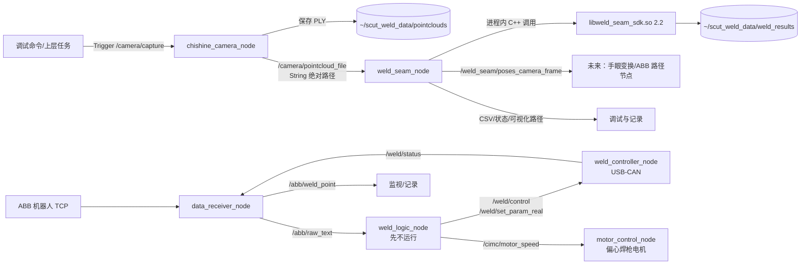

# SCUT/CIMC x86 ROS 2 精简工作区

本工作区面向 Ubuntu 22.04.2 x86_64 + ROS 2 Humble。它由用户提供的“最新的 ros2 代码克隆”精简而来，并增加相机抓图与焊缝共享 SDK 节点。

本版本刻意不提供 launch：前期按节点单独启动、观察、停止，避免相机、CAN、ABB 网络或算法中的任一故障被“一键启动”掩盖。等所有节点在工控机上分别验收后再设计生产 launch/systemd。

## 1. 最终目录和保留内容

```text
x86_ros2_ws/
├── README.md
├── order.txt
└── src/
    ├── cimc/                    # Python：ABB 数据 + 旋转焊枪电机
    ├── weld_controller/         # C++：USB-CAN 焊机 + 焊接工艺逻辑
    ├── chishine_camera_ros2/    # C++：相机发现、软件触发、PLY 发布
    └── weld_seam_perception/    # C++：进程内调用 weld_seam_sdk
```

已排除历史 `build/install/log`、VS Code 配置、旧算法副本、DOE 测试节点、测试目录、`__pycache__` 和旧 launch。`weld_logic_node` 仍编译和安装，但前期按要求不启动。

每个包目录均有自己的中文 `README.md`，说明内部源码、参数和接口。

## 2. 节点关系总图



相机节点与算法节点通过“文件绝对路径”解耦。相机服务返回成功且 PLY 完整写盘后才发布路径，算法节点收到路径后同步提取，避免读取半写文件。

## 3. 为什么 ROS 2 不启动算法可执行文件

最终选择共享库进程内调用，独立 CLI 只用于离线回归。

| 方案 | 开销/可靠性 | 结论 |
|---|---|---|
| ROS 节点 `fork/exec` CLI | 每次创建进程、拼接命令行、解析退出码；错误和结果只能靠文本/文件传递 | 保留作人工测试，不作为正式节点 |
| ROS 节点链接 `libweld_seam_sdk.so` | 无进程创建，参数/状态/计时为结构化 C++ 数据；可直接发布 PoseArray | 当前采用 |

真正主要耗时仍是 PLY I/O、法向量和平面/焊缝算法，进程内调用不能消除这些计算，但不会增加不必要的进程调度和二次解析。算法 SDK 与 CLI 来自同一个 `main.cpp`，可减少“离线结果与 ROS 结果不一致”的风险。

## 4. 新工控机安装基础环境

先完成 ROS 2 Humble 官方安装，再安装本工程依赖：

```bash
source /opt/ros/humble/setup.bash
sudo apt update
sudo apt install -y \
  build-essential cmake git \
  python3-colcon-common-extensions python3-rosdep python3-serial \
  libpcl-dev libeigen3-dev \
  ros-humble-rclcpp ros-humble-rclpy \
  ros-humble-std-msgs ros-humble-std-srvs ros-humble-geometry-msgs
```

如首次使用 rosdep：

```bash
sudo rosdep init       # 已初始化时会提示，忽略即可
rosdep update
```

## 5. 先构建并安装焊缝 SDK

ROS 包 `weld_seam_perception` 通过 CMake config 查找 SDK：

```bash
cd ~/x86_weld_seam_test
cmake -S . -B build -DCMAKE_BUILD_TYPE=Release
cmake --build build -j"$(nproc)"
cmake --install build --prefix "$HOME/scut_weld_sdk_install"

export CMAKE_PREFIX_PATH="$HOME/scut_weld_sdk_install:$CMAKE_PREFIX_PATH"
export LD_LIBRARY_PATH="$HOME/scut_weld_sdk_install/lib:$LD_LIBRARY_PATH"
```

建议把最后两行加入项目专用环境脚本，而不是全局覆盖系统库搜索顺序。

## 6. 准备相机 SDK

如果三个目录保持同级：

```text
~/x86_weld_seam_test
~/x86_ros2_ws
~/x86_chishine_camera_test
```

相机 ROS 包能自动找到 `../x86_chishine_camera_test/vendor_sdk`。也可显式设置，更利于部署日志复现：

```bash
export CHISHINE_3D_CAMERA_SDK_ROOT="$HOME/x86_chishine_camera_test/vendor_sdk"
```

先按相机独立工程 README 运行 `--list` 和 `--capture`，确认 SDK/网卡/相机完全正常。

## 7. 安装 controlcan 头文件和动态库

用户会从 CAN 盒 SDK 手动提供 `controlcan.h` 与 x86_64 `libcontrolcan.so`。推荐安装：

```bash
sudo install -m 0644 controlcan.h /usr/local/include/controlcan.h
sudo install -m 0755 libcontrolcan.so /usr/local/lib/libcontrolcan.so
sudo ldconfig

file /usr/local/lib/libcontrolcan.so
ldd /usr/local/lib/libcontrolcan.so
```

也可以不写系统目录，把两者放在 `/opt/controlcan/include` 和 `/opt/controlcan/lib`，构建时加：

```bash
export CONTROLCAN_ROOT=/opt/controlcan
```

`weld_controller/CMakeLists.txt` 会明确检查头文件和库；缺一项就停止配置，避免链接到错误架构或到运行时才失败。

## 8. 构建工作区

```bash
cd ~/x86_ros2_ws
source /opt/ros/humble/setup.bash
export CMAKE_PREFIX_PATH="$HOME/scut_weld_sdk_install:$CMAKE_PREFIX_PATH"
export LD_LIBRARY_PATH="$HOME/scut_weld_sdk_install/lib:$LD_LIBRARY_PATH"
export CHISHINE_3D_CAMERA_SDK_ROOT="$HOME/x86_chishine_camera_test/vendor_sdk"

rosdep install --from-paths src --ignore-src -r -y
colcon build --symlink-install \
  --cmake-args -DCMAKE_BUILD_TYPE=Release
source install/setup.bash
```

CAN SDK 尚未就绪时，可先验证其他三个包：

```bash
colcon build --symlink-install \
  --packages-select cimc chishine_camera_ros2 weld_seam_perception \
  --cmake-args -DCMAKE_BUILD_TYPE=Release
```

不建议日常执行 `rm -rf build install log`。只有 CMake 缓存确实污染时才在确认当前目录后清理。

## 9. 运行数据目录

默认根目录：

```text
~/scut_weld_data/
├── pointclouds/     # 相机 PLY
└── weld_results/    # 算法 CSV 与调试 PLY
```

整体迁移到数据盘：

```bash
export SCUT_WELD_DATA_ROOT=/data/scut_weld
mkdir -p "$SCUT_WELD_DATA_ROOT/pointclouds" \
         "$SCUT_WELD_DATA_ROOT/weld_results"
```

运行数据不放进 `src` 或 `install/share`：ROS 安装空间可能只读，重新 `colcon build` 也不应覆盖生产数据。

## 10. 推荐逐节点验收顺序

每个终端先执行：

```bash
source /opt/ros/humble/setup.bash
source ~/x86_ros2_ws/install/setup.bash
export LD_LIBRARY_PATH="$HOME/scut_weld_sdk_install/lib:$LD_LIBRARY_PATH"
```

### 10.1 电机节点

```bash
ros2 run cimc motor_control_node
ros2 topic pub --once /cimc/motor_speed std_msgs/msg/Float32 "{data: 3.0}"
ros2 topic pub --once /cimc/motor_speed std_msgs/msg/Float32 "{data: 0.0}"
```

### 10.2 ABB 数据节点

```bash
ros2 run cimc data_receiver_node
ros2 topic echo /abb/raw_text
ros2 topic echo /abb/weld_point
```

新工控机 IP 若不同，可命令行覆盖，不改源码：

```bash
ros2 run cimc data_receiver_node --ros-args \
  -p listen_host:=192.168.125.2 \
  -p abb_allowed_ip:=192.168.125.1 \
  -p forward_ip:=192.168.125.5
```

### 10.3 焊机 USB-CAN 节点

```bash
ros2 run weld_controller weld_controller_node
ros2 topic echo /weld/status
```

`weld_logic_node` 先不运行。后续单独确认 ABB 状态语义、区域编号和工艺参数后再启动。

### 10.4 相机节点

```bash
ros2 run chishine_camera_ros2 chishine_camera_node --ros-args \
  --params-file ~/x86_ros2_ws/src/chishine_camera_ros2/config/camera.yaml

ros2 service call /camera/capture std_srvs/srv/Trigger "{}"
ros2 topic echo --once /camera/pointcloud_file
```

### 10.5 焊缝节点

```bash
ros2 run weld_seam_perception weld_seam_node --ros-args \
  --params-file ~/x86_ros2_ws/src/weld_seam_perception/config/weld_seam.yaml
```

如果 `auto_process=true`，相机成功发布 PLY 路径后会自动提取。也可人工把已有 PLY 路径发给算法节点：

```bash
ros2 topic pub --once /camera/pointcloud_file std_msgs/msg/String \
  "{data: '/absolute/sample.ply'}"
```

或在收到路径但 `auto_process=false` 时触发最近一帧：

```bash
ros2 service call /weld_seam/extract_latest std_srvs/srv/Trigger "{}"
```

查看结果：

```bash
ros2 topic echo --once /weld_seam/result_csv
ros2 topic echo --once /weld_seam/result_visualization
ros2 topic echo /weld_seam/status
ros2 topic echo --once /weld_seam/poses_camera_frame
```

## 11. 相机到算法的一次完整测试

先启动 `weld_seam_node`，再启动 `chishine_camera_node`，最后调用：

```bash
ros2 service call /camera/capture std_srvs/srv/Trigger "{}"
```

期望事件顺序：

1. 相机完成软件触发并把非空 PLY 写到 `pointclouds/`；
2. 发布 `/camera/pointcloud_file`；
3. 焊缝节点收到路径，SDK 日志显示 `normal.mode=auto` 的复用或重算来源；
4. `weld_results/` 生成 CSV、精确点 PLY、粉红十字可视化 PLY；
5. 发布相机坐标系下 PoseArray 和 JSON 状态。

## 12. 坐标、姿态和未来手眼变换

- 算法 CSV 的位置单位是 mm；四元数按 `qw,qx,qy,qz` 保存。
- `/weld_seam/poses_camera_frame` 按 ROS REP-103 把位置乘 `0.001` 变为 m，四元数不缩放，`frame_id=camera_link`。
- 当前节点不把相机位姿直接当 ABB/TCP 位姿。手眼矩阵必须根据 eye-in-hand/eye-to-hand 标定链正确左乘/右乘，并处理 TCP 与枪尖工具变换。
- 后续建议新建独立手眼/ABB 路径节点，订阅 PoseArray，发布变换后的机器人目标；不要把标定矩阵硬编码进焊缝识别节点。

## 13. 开机运行前的安全边界

1. 相机和算法节点只采集/计算/发布文件与位姿，不应直接驱动 ABB。
2. `weld_logic_node` 会综合控制焊机和旋转电机，前期明确不启动。
3. 在机械臂自动运行前，先离线确认粉红十字中心、四元数、手眼矩阵、枪尖 TCP、工件坐标以及凹角干涉余量。
4. 首次联动应低速、空载、禁弧验证路径，再逐步进入焊接。

更多可复制命令见 `order.txt`；每个节点的完整接口见相应包内 README。
