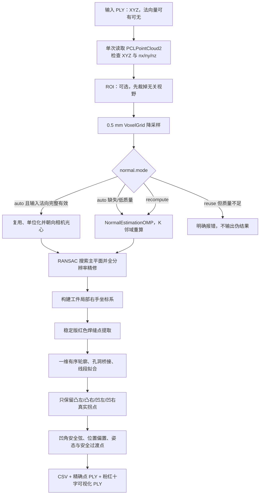

# x86 焊缝提取算法与 SDK 2.2

本目录是 Ubuntu 22.04 x86_64 上的独立算法工程。它同时生成：

- `weld_seam_extractor`：直接输入 PLY、输出 CSV/PLY 的测试程序；
- `libweld_seam_sdk.so`：供 ROS 2 节点或其他 C++ 程序进程内调用的共享库；
- 可安装的头文件和 CMake package，外部工程可使用 `find_package(weld_seam_sdk)`。

算法主体仍是已经过多批波纹板验证的稳定版本。本次只增加法向量输入策略、独立计时和跨工程 SDK 构建，没有改变红色焊缝及四类真实拐点的几何主逻辑。

## 1. 文件说明

| 路径 | 作用 |
|---|---|
| `main.cpp` | 完整焊缝/拐点/姿态算法；既是 CLI 源码也是 SDK 实现 |
| `CMakeLists.txt` | 构建 CLI、共享库、安装包和 CMake 导出配置 |
| `include/weld_seam_sdk/weld_seam_sdk.hpp` | 稳定的 C++ SDK 公共接口 |
| `config/default.conf` | 全部可运行时修改的算法参数及当前生产默认值 |
| `参数手册.md` | 69 个运行参数的逐项中文含义、坐标方向和调参顺序 |
| `cmake/weld_seam_sdkConfig.cmake.in` | 供安装后的 `find_package` 使用 |
| `build/` | 本机编译目录，可删除后重新生成 |
| `output/` | 建议保存独立测试结果，不参与编译 |

## 2. 总处理流程



### 输入和输出数据

1. 输入是相机坐标系中的 PLY。坐标单位必须与现有算法一致，当前样本为 mm。
2. ROI 和几何检测都在 PLY 坐标系中进行；算法内部再根据 L 形底面、侧面建立工件局部坐标系。
3. CSV 的 `x,y,z` 仍是 PLY/相机坐标系下的 mm，四元数也表达同一相机坐标系下的工具姿态。
4. 后续手眼矩阵负责把整个位姿从相机坐标系变换到机器人基座或其他目标坐标系。本 SDK 不擅自应用手眼矩阵。

## 3. 法向量策略（2.2 新增）

`normal.mode` 有三种值：

| 值 | 实际行为 | 使用建议 |
|---|---|---|
| `auto` | 默认。输入 PLY 含高质量法向量就复用，否则自动回退重算 | 生产环境推荐 |
| `recompute` | 忽略 PLY 法向量，体素后按 K 邻域重新估计 | 对比旧稳定版、怀疑相机法向量时使用 |
| `reuse` | 强制使用输入法向量；字段缺失或有效率不足就失败 | 相机法向量质量已被严格验证时使用 |

相机 PLY 文件头常写 `nx/ny/nz`，PCL 标准字段是 `normal_x/normal_y/normal_z`。程序会在内存中归一化字段名，不复制点数据。输入法向量满足以下条件才进入复用快路径：

1. 三个分量同时存在；
2. XYZ 有限的点中，法向量有限且模长非零的比例不低于 `normal.reuse_min_valid_ratio`，默认 `0.995`；
3. 经过 VoxelGrid 后再次检查有效率；
4. 每个法向量重新单位化，并统一朝向 PLY 原点（通常是相机光心），避免左右腰符号因相机法向方向习惯而翻转。

`auto` 的设计目标是：有法向量时节省最耗时的法线估计，没有法向量、字段不完整或质量不可靠时自动保持旧版本稳定行为。

已对当前根目录 4 个原厂 PLY 做二进制字段统计：有效法向比例约为 `0.99957–0.99987`，有效法向模长均值约为 `1.0`，均高于默认 `0.995`，因此会进入复用快路径。新相机/新固件仍应观察终端实际日志，不应只根据文件扩展名判断。

终端会打印：

```text
Normals after VoxelGrid: source=reused_from_input, valid=.../...
```

或：

```text
Normals after VoxelGrid: source=recomputed, valid=.../..., K=20
```

计时现在互不重叠：

- `Normal processing time`：体素后的法向整理或重算耗时；PLY 字段读取/前置有效率检查计入总时间；
- `Primary seam extraction time (excluding normals)`：ROI、体素、平面和红色焊缝提取，不含法向阶段；
- `Secondary feature extraction time`：折线拐点、姿态和输出路径构造；
- `Total time including PLY I/O`：包含读取、全部算法和文件写出。

## 4. Ubuntu 22.04 编译

安装依赖：

```bash
sudo apt update
sudo apt install -y build-essential cmake libpcl-dev libeigen3-dev
```

普通 Release 编译：

```bash
cd ~/x86_weld_seam_test
cmake -S . -B build -DCMAKE_BUILD_TYPE=Release
cmake --build build -j"$(nproc)"
```

如果可执行文件只在当前这台 13 代酷睿工控机使用，可增加 CPU 原生优化：

```bash
cmake -S . -B build \
  -DCMAKE_BUILD_TYPE=Release \
  -DWELD_SEAM_NATIVE_OPTIMIZATION=ON
cmake --build build -j"$(nproc)"
```

`-march=native` 可能更快，但生成的二进制不保证能在较老 CPU 上运行。要交付给其他 x86_64 主机时保持该选项为 `OFF`。

## 5. 独立程序测试

```bash
./build/weld_seam_extractor \
  /absolute/input.ply \
  ./output \
  sample01 \
  --config ./config/default.conf \
  --set normal.mode=auto
```

参数优先级为：源码默认值 `<` 配置文件 `<` 命令行重复出现的 `--set key=value`。

例如临时打开 ROI，无需重新编译：

```bash
./build/weld_seam_extractor input.ply output test \
  --config config/default.conf \
  --set roi.enable=true \
  --set roi.min_y=-90 \
  --set roi.max_y=-30 \
  --set offset.protruding_left.x=2.5
```

只测试法向策略：

```bash
# 自动复用或回退
./build/weld_seam_extractor input.ply output auto --set normal.mode=auto

# 强制重算，用于结果/耗时对照
./build/weld_seam_extractor input.ply output recompute --set normal.mode=recompute

# 强制复用，输入无有效法向时应明确失败
./build/weld_seam_extractor input.ply output reuse --set normal.mode=reuse
```

## 6. 输出文件

以输出前缀 `sample01` 为例：

| 文件 | 内容 |
|---|---|
| `sample01_features.csv` | 机器人路径点、点类型、XYZ、四元数、局部坐标和诊断字段 |
| `sample01_feature_points.ply` | 精确输出坐标点集合 |
| `sample01_result.ply` | 原点云着色、红色焊缝、粉红十字星和姿态方向辅助线 |

粉红色标记由多条线构成，但 CSV 输出坐标是十字中心，不是标记簇中任意一点。

当前路径只输出四类真实焊接拐点：`PROTRUDING_LEFT`、`PROTRUDING_RIGHT`、`RECESSED_LEFT`、`RECESSED_RIGHT`。不完整视野边缘如果不是完整拐点，不再作为焊接特征点；算法会在第一个和最后一个真实焊接点外增加安全过渡点。

## 7. 主要可调参数

完整、可直接运行的列表以 `config/default.conf` 为准。常用分组如下：

- `roi.*`：输入 PLY 坐标系下的长方体裁剪范围；`roi.enable=false` 表示全视野。
- `normal.*`：输入法向复用/重算策略、有效率阈值、K 邻域和线程数。
- `primary.*`：底面/侧面筛选、粗平面搜索体素和侧面原点分位数。
- `feature.*`：轮廓分箱、线段法向投票、孔洞桥接、线段长度、重复角点合并、安全弦和安全过渡距离。
- `orientation.*`：四类拐点的工作角/前进角、工具正 Z 轴定义。
- `offset.start_transition.*`、`offset.end_transition.*`：两个安全过渡点的位置微调。
- `offset.protruding_left/right.*`、`offset.recessed_left/right.*`：四类真实拐点沿工件局部 XYZ 的位置微调。
- `visualization.*`：粉红十字半径、枪体方向线长度，只影响校验显示。

ROI 的数值是 PLY/相机坐标系，不是算法内部工件局部坐标系。例如要删除相机 Y 大于 300 mm 的点：

```text
roi.enable=true
roi.min_y=-inf
roi.max_y=300
```

## 8. 安装共享 SDK，供 ROS 2 使用

推荐安装在用户目录，避免污染系统：

```bash
cmake --install build --prefix "$HOME/scut_weld_sdk_install"
export CMAKE_PREFIX_PATH="$HOME/scut_weld_sdk_install:$CMAKE_PREFIX_PATH"
export LD_LIBRARY_PATH="$HOME/scut_weld_sdk_install/lib:$LD_LIBRARY_PATH"
```

其他 CMake 工程的用法：

```cmake
find_package(weld_seam_sdk 2.2 CONFIG REQUIRED)
target_link_libraries(your_target PRIVATE weld_seam::sdk)
```

C++ 调用入口：

```cpp
weld_seam_sdk::RunOptions options;
options.input_ply = "/data/part.ply";
options.output_directory = "/data/result";
options.output_prefix = "part01";
options.config_file = "/data/default.conf";
options.parameter_overrides = {"normal.mode=auto", "roi.enable=false"};
const weld_seam_sdk::RunResult result = weld_seam_sdk::run(options);
```

## 9. 性能与稳定性建议

1. 必须使用 `Release`，Debug 下 PCL 法向量和 RANSAC 会显著变慢。
2. 优先使用准确 ROI 减少体素和 RANSAC 输入点数；第一次部署保持全视野验证，再逐步收紧。
3. 先用同一 PLY 对比 `auto` 与 `recompute` 的红色焊缝、四类拐点和 CSV。结果一致后保留 `auto`。
4. `normal.reuse_min_valid_ratio` 不建议为追求速度大幅降低；少量零向量可能通过体素传播，进而影响平面法向聚类。
5. 外部程序不要同时并发调用同一个输出前缀，否则输出文件会互相覆盖。ROS 节点已经用互斥锁拒绝并发提取。

## 10. 常见问题

- `PCL not found`：安装 `libpcl-dev`，删除 `build/CMakeCache.txt` 后重新配置。
- 运行时找不到 `libweld_seam_sdk.so.2`：设置 `LD_LIBRARY_PATH`，或安装到 `/usr/local` 后执行 `sudo ldconfig`。
- `normal.mode=reuse requires...`：输入 PLY 无三分量法向或有效率不足；改回 `auto` 或 `recompute`。
- ROI 后为 0 点：ROI 是相机坐标系，检查正负方向和单位。
- 新相机姿态导致左右类别整体反转：先确认输入法向和 `normal.mode` 日志，再检查 `feature.protruding_is_larger_local_y`；不要先随意交换四组位置/姿态参数。
