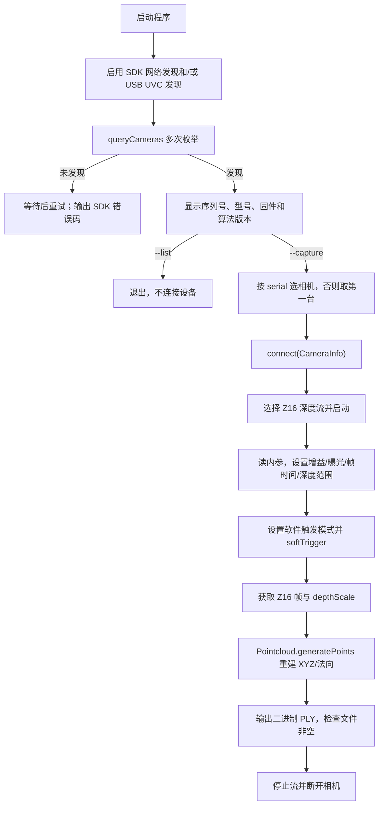

# Chishine3D 相机 x86_64 独立测试工程

本目录用于在 Ubuntu 22.04 x86_64 工控机上先独立验证相机发现、连接、软件触发、深度取帧、三维重建和 PLY 写盘。ROS 2 节点使用同一套厂商 API，因此独立测试通过后再集成，定位问题最清晰。

## 1. 文件说明

| 路径 | 作用 |
|---|---|
| `src/camera_test.cpp` | `--list` 枚举和 `--capture` 软件触发抓图程序 |
| `CMakeLists.txt` | 只面向 Linux x86_64，链接厂商动态库并配置 RPATH |
| `vendor_sdk/inc/3dcamera/` | SDK 3.2.52 必需 C/C++ 头文件 |
| `vendor_sdk/lib/3dcamera/linux/x64/lib3DCamera.so` | 原厂 x86_64 动态库 |
| `vendor_sdk/README.md` | 最小 SDK 子集、版本一致性和动态库 SHA-256 校验 |
| `THIRD_PARTY_NOTICES.md` | 原厂授权条件摘要，交付时必须保留 |
| `build/` | 本机编译目录 |
| `output/` | 建议保存测试 PLY |

没有复制原厂 600MB 的 Windows、ARM、示例二进制和无关数据，只保留 x86_64 测试所需内容。`lib3DCamera.so` 仍受原厂授权约束，不可反编译，也不可用于其他品牌相机。

## 2. 相机程序执行流程



## 3. IP 到底在哪里设置

厂商 C++ API 的连接入口是：

```cpp
queryCameras(cameras);
camera->connect(selected_camera_info);
```

SDK 3.2.52 没有公开 `connect(camera_ip, host_ip)` 形式。因此：

- 相机 IP 在相机自身配置工具/原厂工具中设置；
- 工控机相机网卡 IP 在 Ubuntu 网络配置中设置；
- 程序通过网络发现得到 `CameraInfo`，再按序列号连接；
- `--serial` 用来区分多台已发现的相机，不是 IP 参数。

先查看网卡：

```bash
ip -br link
ip -br addr
ip route
```

如果相机为固定 IP，应把连接相机的网口设置在可达子网。示例中的地址仅是格式示意，必须替换为相机实际网段：

```bash
nmcli connection show
sudo nmcli connection modify "有线连接名称" \
  ipv4.method manual \
  ipv4.addresses "<工控机相机网卡IP>/<前缀长度>" \
  ipv4.gateway ""
sudo nmcli connection up "有线连接名称"
```

ABB 通讯网和相机网如果地址规划不同，建议使用两块独立网卡，并分别配置路由。不要因为 `data_receiver_node` 默认监听 `192.168.125.2` 就擅自把相机也设到这一地址。

## 4. 编译前检查

```bash
cd ~/x86_chishine_camera_test
file vendor_sdk/lib/3dcamera/linux/x64/lib3DCamera.so
ldd vendor_sdk/lib/3dcamera/linux/x64/lib3DCamera.so
```

`file` 应显示 `ELF 64-bit ... x86-64`。`ldd` 中任何 `not found` 都要先安装对应系统库；不要等到 ROS 节点启动时才处理。

编译：

```bash
sudo apt update
sudo apt install -y build-essential cmake
cmake -S . -B build -DCMAKE_BUILD_TYPE=Release
cmake --build build -j"$(nproc)"
```

CMake 会把 `lib3DCamera.so` 复制到可执行文件旁，并写入 RPATH。检查：

```bash
ldd build/chishine_camera_test
```

## 5. 第一步：只枚举相机

网络和 USB 都启用：

```bash
./build/chishine_camera_test --list
```

只测试网络相机：

```bash
./build/chishine_camera_test --list --network true --usb false
```

只测试 USB：

```bash
./build/chishine_camera_test --list --network false --usb true
```

程序默认枚举 10 次，每次超时 3000 ms，间隔 1000 ms。相机/交换机刚上电时第一次为空并不立即判定失败。

## 6. 第二步：软件触发并生成 PLY

使用第一台相机：

```bash
./build/chishine_camera_test \
  --capture ./output/capture01.ply
```

指定序列号和当前焊接工作距离：

```bash
./build/chishine_camera_test \
  --capture ./output/capture01.ply \
  --serial "实际序列号" \
  --depth-min-mm 460 \
  --depth-max-mm 520 \
  --gain 1.0 \
  --exposure 8000 \
  --frame-time 10000
```

默认输出二进制 PLY，体积更小、读写更快。人工检查文件头时可临时加 `--ascii`，生产采集不建议使用 ASCII。

如需固定深度流分辨率/帧率：

```bash
./build/chishine_camera_test --capture output/fixed.ply \
  --width 1920 --height 1200 --fps 10
```

程序会先打印相机支持的全部深度流。如果指定组合不存在，将明确报错，不会悄悄选择错误格式。

## 7. 输出 PLY 与焊缝算法的关系

`Pointcloud.generatePoints(..., true)` 会去除无效深度并生成点坐标；原厂导出的 PLY 常含：

```text
property float x
property float y
property float z
property float nx
property float ny
property float nz
```

焊缝 SDK 2.2 的 `normal.mode=auto` 能识别这组 `nx/ny/nz` 并复用，有利于缩短处理时间。如果某型号/固件输出的 PLY 没有法向量，算法会在体素后自动重算，不需要先运行单独的法线转换程序。

## 8. 命令行参数

| 参数 | 默认值 | 作用 |
|---|---:|---|
| `--list` | 是 | 只发现和显示相机 |
| `--capture FILE` | 无 | 触发一帧并写指定 PLY |
| `--serial TEXT` | 第一台 | 多相机时按序列号选择 |
| `--network` | `true` | 是否启用网络发现 |
| `--usb` | `true` | 是否启用 USB/UVC 发现 |
| `--attempts` | `10` | 枚举次数 |
| `--discovery-timeout-ms` | `3000` | 单次枚举超时 |
| `--retry-ms` | `1000` | 枚举间隔 |
| `--capture-timeout-ms` | `5000` | 软件触发后等帧超时 |
| `--width/--height/--fps` | `0` | `0` 表示任意匹配流 |
| `--depth-min-mm` | `460` | 相机深度算法下限 |
| `--depth-max-mm` | `520` | 相机深度算法上限 |
| `--gain` | `1.0` | 深度增益 |
| `--exposure` | `8000` | 深度曝光 |
| `--frame-time` | `10000` | 深度帧时间 |
| `--ascii` | 关闭 | 改为 ASCII PLY |

属性设置失败时，增益/曝光/范围等可选属性会告警并保留相机当前值；软件触发模式、Z16 流、内参或帧数据失败则立即停止，避免产生看似正常但实际无效的 PLY。

## 9. 常见故障顺序

1. `lib3DCamera.so: cannot open`：先看 `ldd build/chishine_camera_test`，不要复制错误架构库。
2. 网络相机枚举为空：看物理链路灯、`ip -br addr`、子网/路由、防火墙，然后再运行 `--list --usb false`。
3. USB 相机枚举为空：看 `lsusb`、供电、线缆、USB 权限，并运行 `--list --network false`。
4. 可枚举但 connect 失败：检查是否被原厂工具或另一进程独占，并确认序列号。
5. softTrigger 超时：先使用默认流；检查曝光/帧时间/工作距离，不要一开始固定不支持的分辨率。
6. PLY 点数为 0：核对深度范围是否覆盖工件实际距离。

独立程序通过后，再进入 `x86_ros2_ws` 测试 `/camera/capture`，可把“相机/网络问题”和“ROS 2 配置问题”明确分开。
